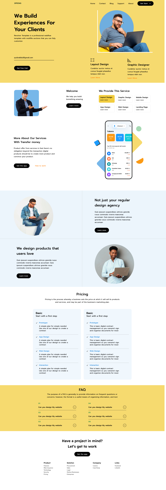
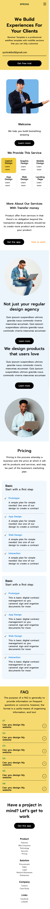

# A Yellow Theme Spring Project

A responsive and modern website designed using Figma and coded into HTML, CSS, and JavaScript.

## Overview

The Spring project showcases a clean and minimalistic design with a focus on providing a user-friendly experience. This website is built with responsive design principles, ensuring a seamless experience across various devices, including desktops, tablets, and smartphones.

## Features

- Fully responsive layout that adapts to different screen sizes.
- Clean and modern design based on a Figma template.
- Interactive elements powered by JavaScript.
- Easy-to-navigate user interface with smooth animations.

## Tech Stack

- **HTML**: Markup for the website's structure.
- **CSS**: Vanilla CSS for styling and layout.
- **JavaScript**: For interactive features and functionality.

## Live Preview

You can view a live version of this project at the following URL:

[Live Preview](https://extraordinary-kitten-03db88.netlify.app)

## Screenshots

Here are some screenshots of the Spring project:

_Homepage View_

_Mobile View_
